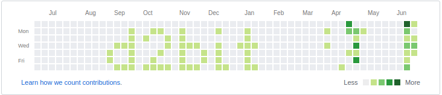

# GH CONTRIBUTIONS

Paint some text in the GitHub contributions panel by creating date changed commits.

## How to run

From inside a git repo run

`node ../path_to/gh_contributions d2bit`

it will create commits to paint the word 'd2bit'

## TODO

- [ ] Complete all the alphabet
- [ ] Make start date configurable
